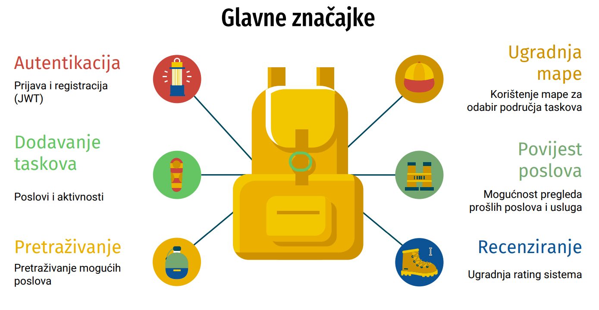
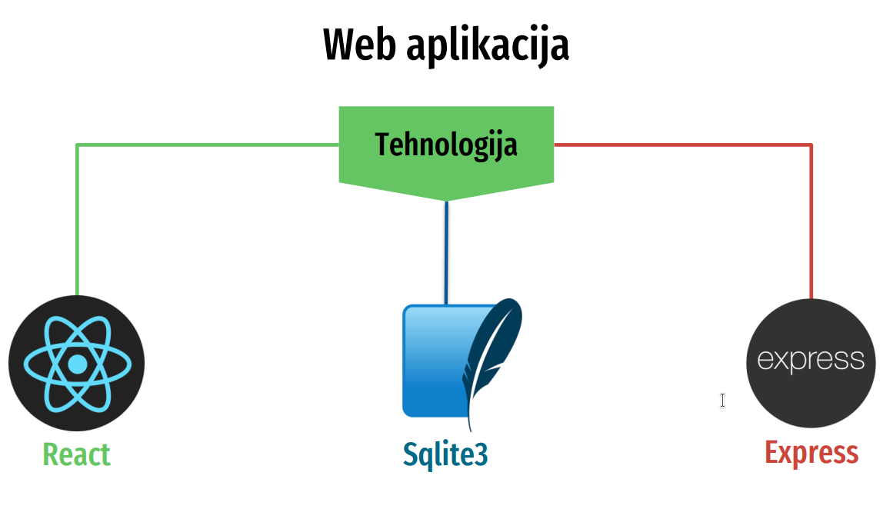
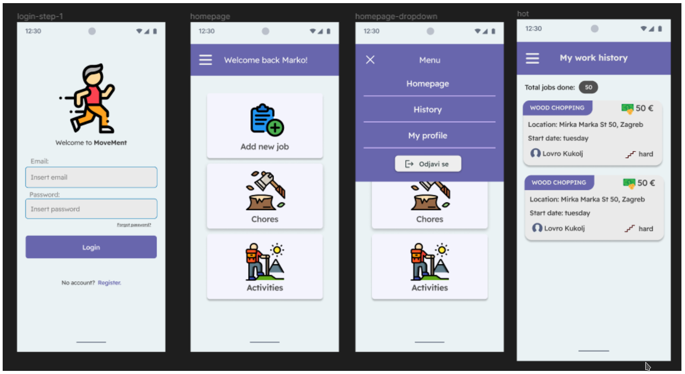

# Ri-Hack 2023 Hackathon

## Introduction
Our team participated in the `Ri-Hack` 2023 hackathon, where the challenge was to develop an application aimed at promoting healthy lifestyles among users. We brainstormed various ideas and eventually came up with a unique concept to create an application that facilitates users in helping each other accomplish specific tasks related to leading a healthier lifestyle.

## Project Concept
We conceptualized an application where users could set specific tasks for other users to complete on their behalf. These tasks could range from physical activities like chopping wood, going shopping, walking a dog, or any other activity conducive to a healthier lifestyle. The idea was to encourage social interaction and mutual support among users, fostering a sense of community and accountability towards health-related goals.

## Key Features
- **Task Assignment**: Users can create tasks and assign them to other users based on specific criteria such as location, time, duration, and skill requirements.
- **Task Completion Verification**: To ensure accountability and authenticity, users must satisfy certain predefined rules and requirements before posting a job. This includes providing proof of completion or meeting certain conditions set by the task creator.
- **Reward System**: We implemented a reward system where users earn points or incentives for completing tasks. This gamification aspect adds motivation and encourages active participation.
- **User Profiles and Ratings**: Each user has a profile showcasing their skills, preferences, and completed tasks. Users can rate each other based on their experiences, fostering trust and reliability within the community.
- **Community Engagement**: The application includes features for users to interact, share tips, advice, and motivate each other towards leading healthier lifestyles.

*MoveMent Functionalities: A visual representation of the main functionalities of the application.*

## Implementation Details
We utilized modern web development technologies and frameworks to build the application, ensuring scalability, performance, and user-friendly interface. The backend was developed using `Node.js` with `Express` framework for route handling, providing robustness and flexibility for handling user data, task management, and communication functionalities. For the frontend, we used `React.js` to create a responsive and intuitive user interface, enhancing the overall user experience.

*Tehcnologies Diagram: A representation of the all the main used technologies within the application.*

## Conclusion
Overall, our project aimed to address the challenge of promoting healthy lifestyles by leveraging the power of community and social support. By facilitating task delegation and mutual assistance, we envisioned our application as a platform for individuals to come together, support each other.

*Application desing: In the image below there are main screens of the application.*

**TL;DR: We won (:**